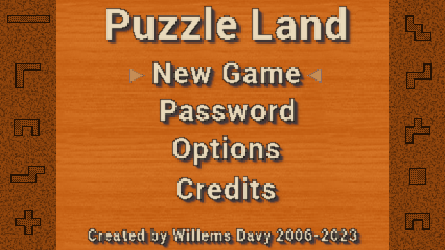
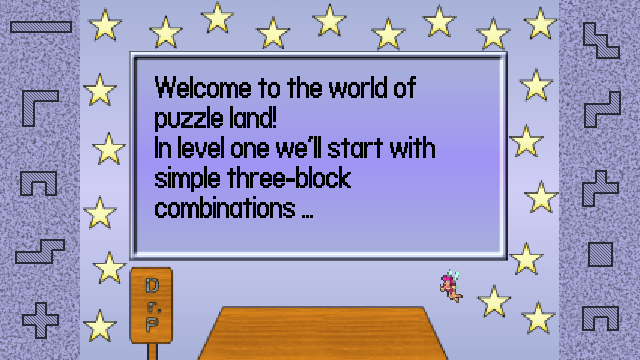
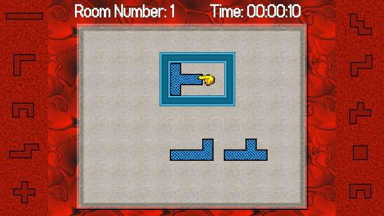
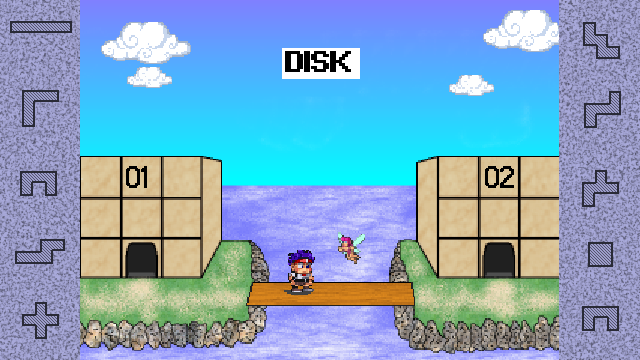

# Puzzle Land Vircon32 Version
   

Puzzle Land is a remake of the gameboy game Daedalian opus also known as puzzle road in japan. The gameplay and levels are the same but the graphics, music sounds have changed. It's a puzzle game with 36 levels. It is a tribute to a game i spend endless hours playing as a child.

## Screenshots

## Vircon32 Game Features:
- 36 Levels
- Faithfull Gameboy game Remake
- Autosaves progress

## Playing the Game:
The aim of the game, is to solve the puzzles in any puzzle room with the pieces you are given by moving the pieces into place such that the predefined shape is completely filled.

## Controls

| Button | Action |
| ------ | ------ |
| Dpad | Select menu's, options. During gameplay move the selector hand around. |
| A | Confirm in menu. During gameplay (de)select a puzzle piece |
| B | Back in menu. During gameplay rotate activated puzzle piece |
| X | During gameplay flip activated puzzle piece horizontally |
| Y | During gameplay flip activated puzzle piece vertically |
| R | During gameplay reset room |

## Credits
Yann R. Fernandez aka Ryf Made the main character, fairy, shadow and the clouds graphics.

Music by MusMus [https://musmus.main.jp/](https://musmus.main.jp/)

Mini2X Font by [donald hays](https://devforum.play.date/t/some-small-fonts/1356)

text.wav: Gamemaster Audio - Pro Sound Collection v1.3 - 16bit - https://www.gamedevmarket.net/asset/pro-sound-collection/
bridge.wav (cartoon Split) & elf.wav (harp) - a1freesoundeffects (no longer exists, but webarchive has it http://web.archive.org/web/20050701021700/http://www.a1freesoundeffects.com/noflash.htm )

Other sounds is unknown, the game was made 15-20 years ago in different times and i did not keep track of where i got the sounds from or if i created them myself. I know used to use sfxr a lot in those times, if you happend to recognize any sound file please let me know
